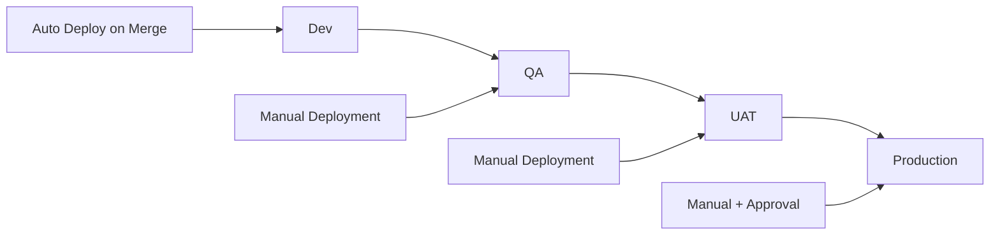

# GitHub Configuration and Workflows

This directory contains the complete GitHub Actions CI/CD pipeline and configuration for the Azure Terraform Enterprise infrastructure repository.

## 📁 Directory Structure

```
.github/
├── workflows/                           # GitHub Actions workflows
│   ├── terraform-deploy.yml            # Main deployment pipeline
│   ├── terraform-validate.yml          # Code quality & security validation
│   ├── terraform-drift-detection.yml   # Infrastructure drift detection
│   ├── terraform-backend-setup.yml     # Azure backend management
│   └── terraform-pr-automation.yml     # Pull request automation
├── copilot-instructions.md             # AI coding assistant guidance
├── WORKFLOWS.md                        # Comprehensive workflow documentation
└── README.md                           # This file
```

## 🚀 Quick Start

### 1. Initial Setup

1. **Configure Azure Credentials:**
   ```bash
   # Create service principal
   az ad sp create-for-rbac --name "terraform-github-actions" \
     --role "Contributor" \
     --scopes "/subscriptions/<subscription-id>" \
     --sdk-auth
   ```

2. **Add Repository Secrets:**
   - Go to Repository → Settings → Secrets and variables → Actions
   - Add `AZURE_CREDENTIALS` with the service principal JSON output
   - Optionally add `INFRACOST_API_KEY` for cost estimation

3. **Setup Terraform Backend:**
   ```bash
   gh workflow run "Backend Setup" --field action=setup
   ```

### 2. Development Workflow

```bash
# 1. Create feature branch and make changes
git checkout -b feature/new-infrastructure
# ... make your changes ...

# 2. Create PR (triggers automatic validation and planning)
gh pr create --title "Add new infrastructure component"

# 3. Review PR comments with Terraform plans
# 4. Merge when approved (auto-deploys to dev)
```

### 3. Production Deployment

```bash
# Deploy specific layer to production
gh workflow run "Terraform Deploy" \
  --field environment=prod \
  --field layer=networking \
  --field action=apply

# Deploy all layers to production
gh workflow run "Terraform Deploy" \
  --field environment=prod \
  --field layer=all \
  --field action=apply
```

## 🔧 Workflows Overview

| Workflow | Purpose | Triggers | Key Features |
|----------|---------|----------|--------------|
| **terraform-deploy.yml** | Main deployment pipeline | Manual, Push, PR | Multi-environment deployment, layer sequencing |
| **terraform-validate.yml** | Code quality & security | PR, Push | Formatting, validation, security scanning |
| **terraform-drift-detection.yml** | Infrastructure monitoring | Daily schedule, Manual | State drift detection, alerting |
| **terraform-backend-setup.yml** | Backend management | Manual | Azure Storage setup, configuration |
| **terraform-pr-automation.yml** | PR automation | PR events | Change detection, automatic planning |

## 🛡️ Security Features

- **🔒 Azure RBAC Integration** - Service principal with minimal required permissions
- **🛡️ Security Scanning** - Checkov integration with 800+ security checks
- **🔐 State Security** - Encrypted Azure Storage with versioning
- **⚠️ Production Protection** - Manual approvals and deployment delays
- **📋 Compliance Monitoring** - Automated security and compliance reporting

## 📊 Monitoring & Observability

- **📈 Drift Detection** - Daily monitoring across all environments
- **📋 Comprehensive Reporting** - Detailed workflow summaries and artifacts
- **🚨 Automated Alerting** - GitHub issues for production drift
- **📄 Audit Trails** - Complete deployment and change history

## 🔄 Environment Promotion Flow



## 📖 Documentation

- **[WORKFLOWS.md](./WORKFLOWS.md)** - Comprehensive workflow documentation
- **[copilot-instructions.md](./copilot-instructions.md)** - AI assistant guidance
- **[../docs/](../docs/)** - Architecture and deployment guides

## 🚨 Troubleshooting

### Common Issues

**Workflow Failures:**
1. Check GitHub Actions logs for detailed error information
2. Verify Azure credentials and permissions
3. Ensure backend configuration is properly set up

**Backend Issues:**
```bash
# Verify backend connectivity
gh workflow run "Backend Setup" --field action=verify

# Update backend configurations
gh workflow run "Backend Setup" --field action=update-configs
```

**Drift Detection Alerts:**
1. Review drift detection artifacts in workflow run
2. Investigate changes in Azure portal
3. Apply remediation using deployment workflows

### Support Commands

```bash
# Check workflow status
gh workflow list

# View recent workflow runs
gh run list

# Download workflow artifacts for analysis  
gh run download <run-id>

# Trigger specific workflow manually
gh workflow run "Terraform Deploy" --field environment=dev
```

## 🔄 Maintenance

### Regular Tasks

- **Weekly:** Review drift detection reports
- **Monthly:** Update Terraform and provider versions
- **Quarterly:** Rotate service principal credentials
- **Annually:** Review and update security policies

### Workflow Updates

When updating workflows:
1. Test changes in a feature branch
2. Use workflow dispatch for testing
3. Monitor deployment results carefully
4. Update documentation as needed

## 📞 Getting Help

1. **Check Documentation:** Review [WORKFLOWS.md](./WORKFLOWS.md) for detailed guidance
2. **GitHub Issues:** Create issues for bugs or feature requests  
3. **Workflow Logs:** Always check GitHub Actions logs first
4. **Local Testing:** Use Makefile commands for local debugging

---

*This CI/CD pipeline is designed for enterprise-grade Terraform deployments with comprehensive automation, security, and monitoring capabilities.*