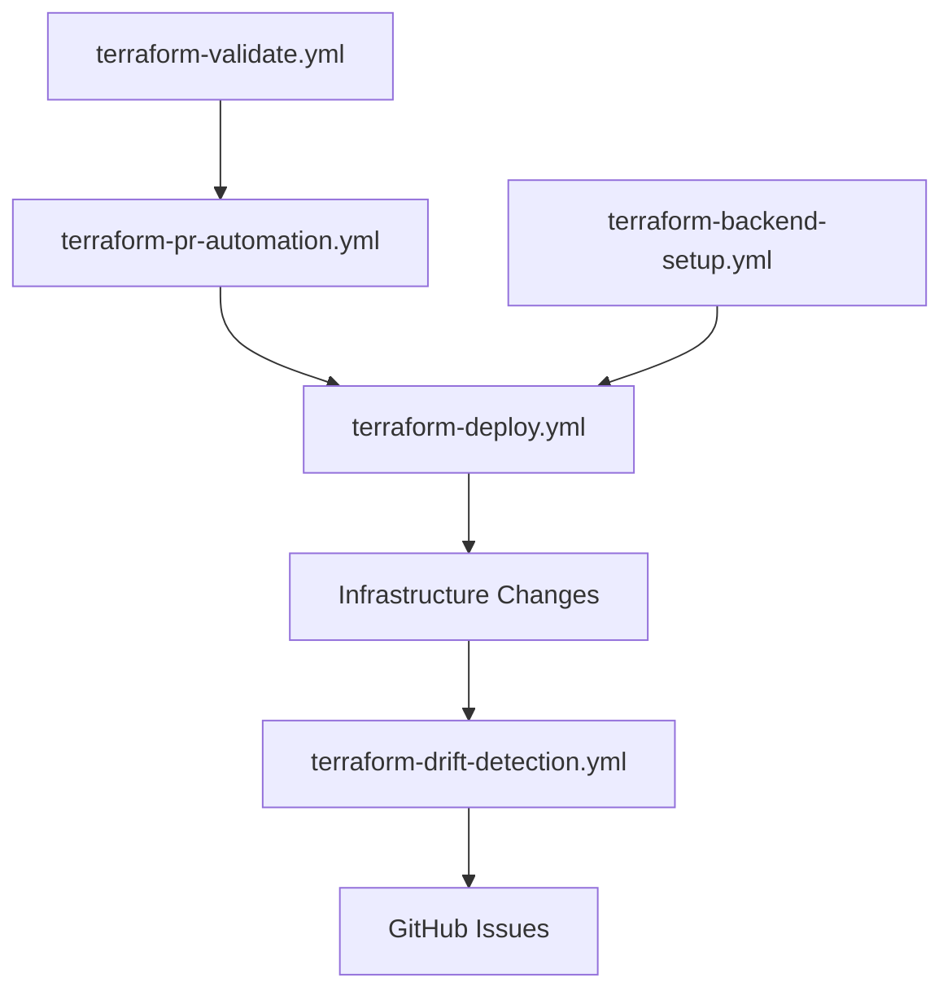

# GitHub Actions Workflows Documentation

## 🚀 Comprehensive CI/CD Pipeline for Terraform Enterprise Infrastructure

This repository includes a complete set of GitHub Actions workflows designed for enterprise-grade Terraform deployments on Azure. The workflows follow DevOps best practices with automated testing, security scanning, drift detection, and multi-environment deployment capabilities.

## 📋 Workflow Overview

### 1. 🚀 Terraform Deploy (`terraform-deploy.yml`)

**Primary deployment workflow** supporting manual and automated deployments across all layers and environments.

**Triggers:**
- **Manual dispatch** with environment/layer selection
- **Push to main** (auto-deploys to dev)
- **Pull requests** (plan-only)

**Features:**
- ✅ Sequential layer deployment following dependency chain
- ✅ Environment-specific configurations
- ✅ Production protection with delays and approvals  
- ✅ Comprehensive plan/apply/destroy operations
- ✅ Artifact management for plan files
- ✅ Detailed step summaries and notifications

**Usage Example:**
```bash
# Deploy networking layer to production
gh workflow run "Terraform Deploy" \
  --field environment=prod \
  --field layer=networking \
  --field action=apply

# Deploy all layers to development  
gh workflow run "Terraform Deploy" \
  --field environment=dev \
  --field layer=all \
  --field action=apply \
  --field auto_approve=true
```

### 2. 🔍 Code Quality & Security (`terraform-validate.yml`)

**Comprehensive validation and security scanning** for all Terraform code.

**Triggers:**
- **Pull requests** to main/develop
- **Push to main** branch
- **Manual dispatch**

**Validation Steps:**
1. **Terraform Formatting** - Ensures consistent code style
2. **Configuration Validation** - Validates all layer configurations
3. **TFLint Analysis** - Static analysis with Azure ruleset
4. **Security Scanning** - Checkov security and compliance checks
5. **Documentation Validation** - Ensures modules and variables are documented
6. **Cost Estimation** - Optional Infracost integration

**Quality Gates:**
- ❌ Fails on formatting issues
- ⚠️ Warns on high number of lint/security issues  
- ✅ Passes with comprehensive reporting

### 3. 🔍 Drift Detection (`terraform-drift-detection.yml`)

**Automated infrastructure drift detection** comparing actual Azure state with Terraform configurations.

**Triggers:**
- **Daily at 6 AM UTC** (scheduled)
- **Manual dispatch** with environment/layer filtering

**Detection Process:**
1. **Matrix Generation** - Creates combinations of environments/layers
2. **State Refresh** - Updates Terraform state from Azure
3. **Plan Analysis** - Detects changes using `terraform plan`
4. **Drift Reporting** - Detailed analysis and recommendations
5. **Issue Creation** - Auto-creates GitHub issues for production drift

**Outputs:**
- 📊 Drift detection reports
- 📋 Change summaries with resource counts
- 🚨 Automatic GitHub issues for production drift
- 💾 Plan artifacts for further analysis

### 4. 🗄️ Backend Setup (`terraform-backend-setup.yml`)

**Azure Storage backend management** for Terraform state files.

**Operations:**
- **setup** - Creates Azure Storage backend infrastructure
- **update-configs** - Updates backend.conf files with storage account names
- **verify** - Tests connectivity to all backend configurations
- **cleanup** - Safely removes state files with backup

**Backend Features:**
- 🔒 Secure Azure Storage with encryption
- 📝 Blob versioning and lifecycle management
- 🛡️ Access control with Azure RBAC
- ♻️ Automatic cleanup of old state versions
- 💾 Backup capabilities before cleanup operations

### 5. 🔄 PR Automation (`terraform-pr-automation.yml`)

**Intelligent pull request automation** with change detection and plan generation.

**Features:**
- 🔍 **Change Detection** - Identifies modified layers and modules
- 📋 **Automatic Planning** - Generates plans for affected components
- 💬 **PR Comments** - Updates PR with detailed plan results
- 🎯 **Status Checks** - Sets commit status for merge requirements
- 🤖 **Auto-approval** - Approves safe changes (no infrastructure changes)

**PR Comment Features:**
- 📈 Change summaries (add/change/destroy counts)
- 📋 Collapsible plan details
- ❌ Error reporting with details
- 🔗 Links to workflow runs and artifacts

## 🔧 Setup Requirements

### 1. GitHub Secrets Configuration

Required secrets for workflow operation:

```bash
# Azure Service Principal (Required)
AZURE_CREDENTIALS='{"clientId":"xxx","clientSecret":"xxx","subscriptionId":"xxx","tenantId":"xxx"}'

# Optional: Cost Estimation
INFRACOST_API_KEY="ico-xxx"  # For cost analysis in PRs
```

### 2. Azure Service Principal Setup

Create a service principal with required permissions:

```bash
# Create service principal
az ad sp create-for-rbac \
  --name "terraform-github-actions" \
  --role "Contributor" \
  --scopes "/subscriptions/<subscription-id>" \
  --sdk-auth

# Additional permissions for backend setup
az role assignment create \
  --role "Storage Blob Data Contributor" \
  --assignee "<service-principal-id>" \
  --scope "/subscriptions/<subscription-id>"
```

### 3. Repository Configuration

Enable required repository settings:

1. **Actions** → Enable GitHub Actions
2. **Environments** → Create `dev`, `qa`, `uat`, `prod` environments  
3. **Branch Protection** → Require status checks for main branch
4. **Pull Requests** → Enable automatic checks

## 📖 Usage Patterns

### Development Workflow

```bash
# 1. Create feature branch
git checkout -b feature/new-infrastructure

# 2. Make changes to modules/layers
# ... edit files ...

# 3. Create pull request
gh pr create --title "Add new infrastructure"
# → Automatically triggers validation and planning

# 4. Review PR comments with plan details
# → Merge when approved

# 5. Deploy to dev automatically (on merge)
# → Monitor workflow in Actions tab
```

### Environment Promotion

```bash
# 1. Deploy to dev (automatic on merge)

# 2. Promote to qa
gh workflow run "Terraform Deploy" \
  --field environment=qa \
  --field layer=all \
  --field action=apply

# 3. Promote to uat
gh workflow run "Terraform Deploy" \
  --field environment=uat \
  --field layer=all \
  --field action=apply

# 4. Deploy to production (with approvals)
gh workflow run "Terraform Deploy" \
  --field environment=prod \
  --field layer=all \
  --field action=apply
```

### Maintenance Operations

```bash
# Setup new backend storage
gh workflow run "Backend Setup" --field action=setup

# Update backend configurations
gh workflow run "Backend Setup" \
  --field action=update-configs \
  --field storage_account_name=mynewstorage

# Check for configuration drift
gh workflow run "Drift Detection" --field environment=prod

# Verify backend connectivity
gh workflow run "Backend Setup" --field action=verify
```

## 🛡️ Security Features

### Production Safeguards
- **Environment Protection Rules** - Manual approval required for production
- **Deployment Delays** - 30-second delay before production apply
- **Access Controls** - RBAC integration with Azure
- **Audit Trails** - Comprehensive logging of all operations

### Security Scanning
- **Checkov Integration** - 800+ security and compliance checks
- **TFLint Rulesets** - Azure-specific linting rules
- **Vulnerability Detection** - Scans for misconfigurations
- **Compliance Reporting** - Generates security reports

### State Security
- **Encrypted Storage** - Azure Storage with encryption at rest
- **Access Logging** - Audit access to state files  
- **Versioning** - Automatic versioning with cleanup policies
- **Backup Integration** - Automated backups before destructive operations

## 📊 Monitoring and Observability

### Workflow Monitoring
- **Job Status Tracking** - Real-time status in GitHub Actions
- **Artifact Management** - Plan files, reports, and logs stored as artifacts
- **Step Summaries** - Detailed markdown summaries for each workflow
- **Notifications** - GitHub issues created for drift and failures

### Drift Detection
- **Scheduled Monitoring** - Daily checks across all environments
- **Change Analysis** - Detailed breakdown of detected changes
- **Root Cause Investigation** - Tools and reports for analysis
- **Remediation Guidance** - Step-by-step fix recommendations

## 🚨 Troubleshooting

### Common Issues

**Backend Configuration Errors:**
```bash
# Check backend.conf files for placeholders
grep -r "<STORAGE_ACCOUNT_NAME>" layers/*/environments/*/backend.conf

# Run backend setup to fix
gh workflow run "Backend Setup" --field action=setup
```

**Plan Failures:**
```bash
# Check workflow logs in GitHub Actions
# Download plan artifacts for local analysis
# Verify Azure credentials and permissions
```

**Drift Detection Issues:**
```bash
# Check if state files exist
# Verify backend connectivity
# Review Azure resource changes
```

### Debug Commands

```bash
# Local plan debugging
make init LAYER=networking ENV=dev
make plan LAYER=networking ENV=dev

# Validate all configurations
make validate-all

# Check formatting
make format
```

## 🔄 Workflow Dependencies



## 📈 Best Practices

### Workflow Usage
1. **Always validate** before deploying with PR automation
2. **Follow promotion path** dev → qa → uat → prod  
3. **Monitor drift detection** and respond to alerts promptly
4. **Use manual approvals** for production deployments
5. **Review artifacts** before applying plans

### Security
1. **Rotate secrets** regularly (service principal credentials)
2. **Monitor access logs** for unauthorized changes
3. **Review security scan results** and fix high-priority issues
4. **Keep backend storage** in dedicated resource group with locks

### Maintenance  
1. **Clean up artifacts** older than 30 days
2. **Review workflow performance** and optimize as needed
3. **Update Terraform versions** in workflows regularly
4. **Test disaster recovery** procedures periodically