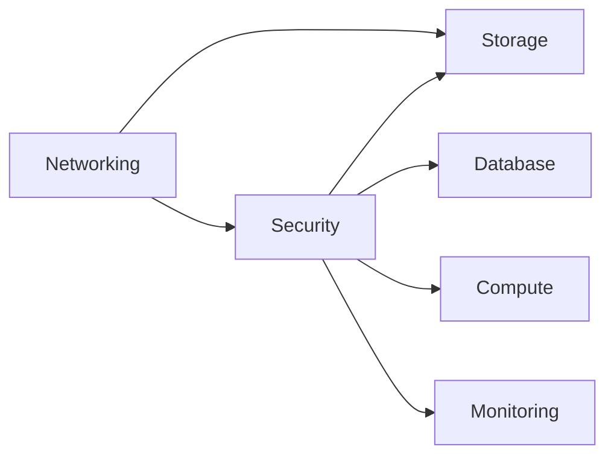

# 🚀 GitHub Actions Pipeline for Terraform Azure Enterprise

## Quick Start

This repository includes comprehensive GitHub Actions pipelines for deploying multi-layered Terraform infrastructure to Azure. The pipelines support automatic planning, sequential deployment, and safe destruction across multiple environments.

## 📋 Prerequisites

- Azure CLI installed and configured
- GitHub CLI (optional, for automated secret setup)
- Terraform >= 1.5.0
- jq (for JSON processing)
- Git repository with appropriate permissions

## ⚡ Quick Setup

Run the automated setup script:

```bash
# Make the script executable
chmod +x scripts/setup-pipeline.sh

# Run the setup script
./scripts/setup-pipeline.sh
```

This script will:
- ✅ Create Azure resources (storage account, service principal)
- ✅ Configure GitHub secrets automatically
- ✅ Generate environment configuration files
- ✅ Provide setup instructions for environment protection

## 🏗️ Pipeline Architecture

### Workflows Overview

| Workflow | Trigger | Purpose | Protection |
|----------|---------|---------|------------|
| **terraform-plan.yml** | Pull Request | Generate and validate plans | None |
| **terraform-apply.yml** | Push to main/develop | Deploy infrastructure | Environment-based |
| **terraform-destroy.yml** | Manual only | Destroy non-prod environments | Confirmation required |
| **reusable-terraform-layer.yml** | Called by others | Reusable layer operations | N/A |

### Layer Dependencies



## 🔧 Configuration

### Environment Variables

Each environment has its own `.tfvars` files in the `environments/` directory:

```
environments/
├── dev/
│   ├── networking.tfvars
│   ├── security.tfvars
│   ├── database.tfvars
│   ├── compute.tfvars
│   ├── storage.tfvars
│   └── monitoring.tfvars
├── staging/
└── prod/
```

### Required GitHub Secrets

| Secret | Description |
|--------|-------------|
| `ARM_CLIENT_ID` | Azure Service Principal Application ID |
| `ARM_CLIENT_SECRET` | Azure Service Principal Secret |
| `ARM_SUBSCRIPTION_ID` | Azure Subscription ID |
| `ARM_TENANT_ID` | Azure Tenant ID |
| `TF_STATE_STORAGE_ACCOUNT` | Terraform state storage account name |
| `TF_STATE_RESOURCE_GROUP` | Terraform state resource group name |

## 🔄 Usage Workflows

### Development Workflow

1. **Create Feature Branch**
   ```bash
   git checkout -b feature/add-monitoring-alerts
   ```

2. **Make Changes**
   - Modify Terraform configurations
   - Update environment-specific `.tfvars` files

3. **Open Pull Request**
   - Target `develop` branch for dev environment
   - Target `main` branch for production environment

4. **Review Generated Plans**
   - Plans automatically appear as PR comments
   - Download plan artifacts for detailed review

5. **Merge and Deploy**
   - Merge triggers automatic deployment
   - Monitor progress in GitHub Actions

### Manual Deployment

Use the manual deployment for selective updates or emergency changes:

```yaml
# Go to Actions → Terraform Apply → Run workflow
Environment: prod
Layers: database,monitoring  # Specific layers only
Skip Plan: false            # Always plan first
```

### Environment Destruction

For non-production environments only:

```yaml
# Go to Actions → Terraform Destroy → Run workflow
Environment: dev            # Only dev/staging allowed
Confirmation: DESTROY       # Must type exactly "DESTROY"
Reason: "Environment cleanup after testing"  # Required
```

## 🛡️ Security Features

### Access Control
- **Service Principal**: Dedicated identity with minimal permissions
- **Environment Protection**: Production requires manual approval
- **Branch Protection**: Code review required for main branch
- **Secret Management**: All sensitive data in GitHub Secrets

### Network Security
- **Private Endpoints**: Secure database and storage access
- **Network Security Groups**: Restrict network traffic
- **Azure Firewall**: Centralized traffic filtering (production)
- **DDoS Protection**: Enhanced protection for production

## 📊 Monitoring & Observability

### Pipeline Monitoring
- **Real-time Status**: Live deployment progress tracking
- **Artifact Storage**: Plan files stored for 30 days
- **Comprehensive Logging**: Detailed logs for troubleshooting
- **Notifications**: Teams/Slack integration available

### Infrastructure Monitoring
- **Application Insights**: Application performance monitoring
- **Log Analytics**: Centralized log aggregation
- **Azure Monitor**: Resource health and performance
- **Custom Dashboards**: Environment-specific dashboards

## 🔧 Troubleshooting

### Common Issues

#### State Lock Issues
```bash
# If Terraform state is locked
terraform force-unlock <lock-id>
```

#### Permission Errors
- Verify service principal has Contributor role
- Check subscription access
- Validate secret values in GitHub

#### Plan vs Apply Differences
- Check for concurrent modifications
- Refresh Terraform state
- Verify resource dependencies

### Debug Commands

```bash
# Validate Terraform configuration
terraform validate

# Show current state
terraform show

# List state resources
terraform state list

# Check specific resource
terraform state show <resource_name>
```

## 📈 Best Practices

### Infrastructure
- **Small Changes**: Deploy incremental changes frequently
- **Immutable Infrastructure**: Replace rather than modify resources
- **Resource Tagging**: Consistent tagging for cost management
- **Documentation**: Comment complex configurations

### Security
- **Least Privilege**: Grant minimum necessary permissions
- **Secret Rotation**: Regular credential rotation
- **Network Segmentation**: Use private endpoints
- **Compliance**: Follow security standards

### Cost Management
- **Right Sizing**: Regularly review resource sizes
- **Auto Shutdown**: Implement for non-production environments
- **Reserved Instances**: Use for predictable workloads
- **Cost Alerts**: Set up budget alerts

## 🆘 Support & Resources

### Internal Support
- **Platform Team**: platform-team@company.com
- **Documentation**: [Complete Pipeline Guide](docs/github-actions-pipeline-guide.md)
- **On-Call**: Use PagerDuty for urgent issues

### External Resources
- **Terraform Docs**: [terraform.io](https://terraform.io)
- **Azure Docs**: [docs.microsoft.com/azure](https://docs.microsoft.com/azure)
- **GitHub Actions**: [docs.github.com/actions](https://docs.github.com/actions)

## 📝 Environment-Specific Notes

### Development (`dev`)
- **Auto-deploy**: Triggered by push to `develop` branch
- **Cost-optimized**: Smaller instance sizes, no redundancy
- **Flexible**: Easier to modify and experiment

### Staging (`staging`)
- **Manual deployment**: Via workflow dispatch
- **Production-like**: Similar configuration to production
- **Testing**: Performance and integration testing

### Production (`prod`)
- **Protected**: Requires manual approval and review
- **High availability**: Multi-zone deployment
- **Enhanced security**: All security features enabled
- **Compliance**: Meets regulatory requirements

## 🔄 Migration Guide

If migrating from existing infrastructure:

1. **Import Existing Resources**
   ```bash
   terraform import azurerm_resource_group.example /subscriptions/{subscription-id}/resourceGroups/{rg-name}
   ```

2. **State Migration**
   - Export existing state
   - Import into new backend
   - Validate resource alignment

3. **Gradual Adoption**
   - Start with non-critical resources
   - Layer-by-layer migration
   - Comprehensive testing

---

## 🎯 Next Steps

After setup completion:

1. ✅ **Test Pipeline**: Create small test change
2. ✅ **Configure Environments**: Customize `.tfvars` files
3. ✅ **Set Up Monitoring**: Configure alerts and dashboards
4. ✅ **Team Training**: Train team on workflow usage
5. ✅ **Documentation**: Update any org-specific documentation

---

*For detailed documentation, see [GitHub Actions Pipeline Guide](docs/github-actions-pipeline-guide.md)*