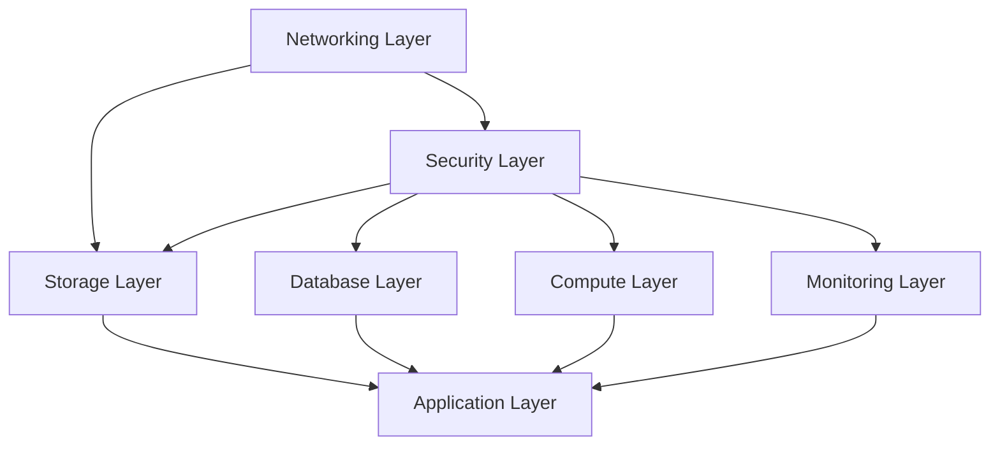

# Terraform Azure Enterprise - GitHub Actions CI/CD Pipeline Documentation

## 📋 Table of Contents
- [Overview](#overview)
- [Architecture](#architecture)
- [Workflows](#workflows)
- [Setup Instructions](#setup-instructions)
- [Usage Guide](#usage-guide)
- [Environment Management](#environment-management)
- [Security](#security)
- [Troubleshooting](#troubleshooting)
- [Best Practices](#best-practices)

## 🚀 Overview

This repository contains comprehensive GitHub Actions pipelines for deploying a multi-layered Terraform infrastructure to Microsoft Azure. The pipeline system supports:

- **Multi-Environment Deployments**: Dev, Staging, and Production
- **Layered Architecture**: Networking, Security, Database, Compute, Storage, and Monitoring
- **Automated Planning**: Pull request-triggered Terraform plans with change detection
- **Sequential Deployment**: Proper dependency management between infrastructure layers
- **Safety Features**: Production protection, confirmation requirements, and rollback capabilities
- **Comprehensive Monitoring**: Detailed logging, notifications, and audit trails

## 🏗️ Architecture

### Infrastructure Layers

The infrastructure is organized into six main layers, deployed in dependency order:



1. **Networking Layer** (Foundation)
   - Virtual Networks (VNets)
   - Subnets and Network Security Groups
   - Route Tables and NAT Gateways
   - Private DNS Zones
   - Network Peering

2. **Security Layer** (Identity & Access)
   - Azure Key Vault
   - Managed Identities
   - Log Analytics Workspace
   - Application Insights

3. **Storage Layer** (Data Storage)
   - Storage Accounts
   - Blob Containers
   - File Shares

4. **Database Layer** (Data Persistence)
   - Azure SQL Database
   - Redis Cache
   - PostgreSQL (optional)
   - Cosmos DB (optional)

5. **Compute Layer** (Processing)
   - Azure Kubernetes Service (AKS)
   - App Services
   - Virtual Machines

6. **Monitoring Layer** (Observability)
   - Application Insights
   - Log Analytics
   - Alert Rules
   - Dashboards

### Environment Mapping

| Branch | Environment | Auto-Deploy | Protection |
|--------|-------------|-------------|------------|
| `develop` | dev | ✅ | None |
| `main` | prod | ✅ | Branch protection + Manual approval |
| Manual | staging | ❌ | Manual trigger only |

## 🔄 Workflows

### 1. Terraform Plan (`terraform-plan.yml`)

**Triggers**: Pull requests to `main` or `develop` branches

**Purpose**: Generates and validates Terraform execution plans

**Features**:
- 🔍 **Change Detection**: Only plans layers with actual changes
- ⚡ **Parallel Execution**: Plans independent layers simultaneously
- 💬 **PR Integration**: Posts plan summaries as PR comments
- 📦 **Artifact Storage**: Saves plan files for apply workflow
- ✅ **Validation**: Runs `terraform validate` on all configurations

**Workflow Steps**:
1. Detect changed files using path filters
2. Run `terraform init` and `terraform validate`
3. Generate plans for affected layers
4. Upload plan artifacts
5. Comment on PR with results summary

### 2. Terraform Apply (`terraform-apply.yml`)

**Triggers**: 
- Push to `main` or `develop` branches
- Manual workflow dispatch

**Purpose**: Applies approved Terraform changes to Azure infrastructure

**Features**:
- 🔒 **Environment Protection**: Production requires manual approval
- 📊 **Dependency Management**: Deploys layers in correct order
- 🎯 **Selective Deployment**: Choose specific layers to deploy
- 📈 **Progress Tracking**: Real-time deployment status
- 🔔 **Notifications**: Teams/Slack integration for completion status

**Workflow Steps**:
1. Validate deployment parameters
2. Deploy networking layer (foundation)
3. Deploy security layer (depends on networking)
4. Deploy storage, database, compute layers (parallel where possible)
5. Deploy monitoring layer
6. Generate comprehensive deployment report

### 3. Terraform Destroy (`terraform-destroy.yml`)

**Triggers**: Manual workflow dispatch only

**Purpose**: Safely destroys non-production environments

**Features**:
- 🛡️ **Production Protection**: Cannot destroy production
- ✍️ **Confirmation Required**: Must type "DESTROY" exactly
- 📝 **Audit Trail**: Requires reason for destruction
- 🔄 **Reverse Order**: Destroys layers in reverse dependency order
- 📊 **Detailed Reporting**: Complete destruction audit log

**Workflow Steps**:
1. Validate destruction request and confirmation
2. Destroy layers in reverse dependency order:
   - Monitoring → Compute → Database → Storage → Security → Networking
3. Generate destruction audit report

### 4. Reusable Layer Workflow (`reusable-terraform-layer.yml`)

**Purpose**: Reusable workflow template for individual layer operations

**Features**:
- 🔧 **Configurable Actions**: Plan, Apply, or Destroy
- 📋 **Plan Summaries**: Detailed change analysis
- 📤 **Output Capture**: Terraform outputs for dependent layers
- ⚡ **Provider Caching**: Speeds up subsequent runs
- 🔍 **Error Handling**: Comprehensive error reporting

## ⚙️ Setup Instructions

### 1. Azure Prerequisites

Create the necessary Azure resources and service principal:

```bash
# Create resource group for Terraform state
az group create --name "rg-terraform-state" --location "East US 2"

# Create storage account for state files
az storage account create \
  --name "terraformstate$(date +%s)" \
  --resource-group "rg-terraform-state" \
  --location "East US 2" \
  --sku "Standard_LRS" \
  --encryption-services blob

# Create container for state files
az storage container create \
  --name "tfstate" \
  --account-name "terraformstate$(date +%s)"

# Create service principal for GitHub Actions
az ad sp create-for-rbac \
  --name "github-actions-terraform" \
  --role "Contributor" \
  --scopes "/subscriptions/{subscription-id}" \
  --sdk-auth
```

### 2. GitHub Repository Setup

#### Required Secrets

Configure these secrets in your GitHub repository settings:

| Secret Name | Description | Example |
|-------------|-------------|---------|
| `ARM_CLIENT_ID` | Service Principal Application ID | `12345678-1234-1234-1234-123456789012` |
| `ARM_CLIENT_SECRET` | Service Principal Secret | `your-secret-value` |
| `ARM_SUBSCRIPTION_ID` | Azure Subscription ID | `12345678-1234-1234-1234-123456789abc` |
| `ARM_TENANT_ID` | Azure Tenant ID | `12345678-1234-1234-1234-123456789def` |
| `TF_STATE_STORAGE_ACCOUNT` | State storage account name | `terraformstate1234567890` |
| `TF_STATE_RESOURCE_GROUP` | State storage resource group | `rg-terraform-state` |

#### Optional Secrets

| Secret Name | Description |
|-------------|-------------|
| `TEAMS_WEBHOOK_URL` | Microsoft Teams webhook for notifications |
| `SLACK_WEBHOOK_URL` | Slack webhook for notifications |

#### Environment Protection Rules

Configure environment protection for production:

1. Go to Settings → Environments
2. Create environment named `prod`
3. Enable "Required reviewers" 
4. Add platform team members as reviewers
5. Enable "Wait timer" for 5 minutes
6. Restrict to `main` branch only

### 3. Branch Protection Rules

Enable branch protection on `main` and `develop`:

```yaml
# Branch Protection Settings
branches:
  - name: main
    protection:
      required_status_checks:
        strict: true
        contexts:
          - "Plan Networking Layer"
          - "Plan Security Layer"
          - "Plan Database Layer"
      enforce_admins: true
      required_pull_request_reviews:
        required_approving_review_count: 2
        dismiss_stale_reviews: true
        require_code_owner_reviews: true
      restrictions:
        users: []
        teams: ["platform-team"]
```

### 4. Directory Structure Setup

Ensure your repository has the following structure:

```
├── .github/
│   └── workflows/
│       ├── terraform-plan.yml
│       ├── terraform-apply.yml
│       ├── terraform-destroy.yml
│       └── reusable-terraform-layer.yml
├── environments/
│   ├── dev/
│   │   ├── networking.tfvars
│   │   ├── security.tfvars
│   │   ├── database.tfvars
│   │   ├── compute.tfvars
│   │   ├── storage.tfvars
│   │   └── monitoring.tfvars
│   ├── staging/
│   └── prod/
├── layers/
│   ├── networking/
│   ├── security/
│   ├── database/
│   ├── compute/
│   ├── storage/
│   └── monitoring/
└── modules/
```

## 📖 Usage Guide

### Development Workflow

1. **Create Feature Branch**
   ```bash
   git checkout -b feature/add-new-database
   ```

2. **Make Infrastructure Changes**
   - Modify Terraform files in appropriate layers
   - Update environment-specific `.tfvars` files

3. **Open Pull Request**
   - Target `develop` for development changes
   - Target `main` for production changes
   - Pipeline automatically generates plans

4. **Review Plans**
   - Check PR comments for plan summaries
   - Download plan artifacts for detailed review
   - Request reviews from team members

5. **Merge and Deploy**
   - Merge PR to trigger deployment
   - Monitor workflow progress in Actions tab

### Manual Deployment

For selective or emergency deployments:

1. **Navigate to Actions Tab**
2. **Select "Terraform Apply" Workflow**
3. **Click "Run workflow"**
4. **Configure Parameters**:
   - Environment: `dev`, `staging`, or `prod`
   - Layers: `all` or comma-separated list
   - Skip Plan: `false` (recommended)

### Emergency Procedures

#### Rollback Deployment
```bash
# Revert to previous working commit
git revert HEAD --no-edit
git push origin main
```

#### Hotfix Process
1. Create hotfix branch from `main`
2. Make minimal necessary changes
3. Open PR with "HOTFIX" label
4. Get expedited review and approval
5. Deploy immediately after merge

#### Infrastructure Destruction (Non-Production)
1. Go to Actions → "Terraform Destroy"
2. Select environment (`dev` or `staging`)
3. Type "DESTROY" in confirmation field
4. Provide detailed reason
5. Monitor destruction progress

## 🌍 Environment Management

### Development Environment (`dev`)

**Purpose**: Feature development and testing

**Characteristics**:
- 💰 Cost-optimized resource sizes
- 🔄 Auto-shutdown capabilities
- ⚡ Minimal redundancy
- 🔧 Flexible security policies

**Access**: All team members

### Staging Environment (`staging`)

**Purpose**: Pre-production testing and validation

**Characteristics**:
- 📊 Production-like configuration
- 🔒 Enhanced security
- 📈 Performance testing ready
- 🧪 Integration testing

**Access**: QA team and senior developers

### Production Environment (`prod`)

**Purpose**: Live customer-facing workloads

**Characteristics**:
- 🛡️ Maximum security and compliance
- 🏗️ High availability and disaster recovery
- 📊 Comprehensive monitoring
- 🔒 Strict access controls

**Access**: Platform team only with approval

### Variable File Management

Each environment has its own `.tfvars` files:

```hcl
# environments/prod/networking.tfvars
environment = "prod"
location    = "East US 2"

# Production-specific settings
enable_ddos_protection = true
enable_azure_firewall  = true
vnet_address_space     = ["10.0.0.0/16"]

# Enhanced security tags
tags = {
  Environment      = "prod"
  SecurityLevel    = "high"
  DisasterRecovery = "required"
  Compliance       = "sox-compliant"
}
```

## 🔐 Security

### Authentication & Authorization

- **Service Principal**: Dedicated service principal with minimal required permissions
- **RBAC**: Role-based access control for Azure resources
- **Secret Management**: All sensitive values stored in GitHub Secrets
- **Audit Logging**: Complete audit trail of all infrastructure changes

### Network Security

- **Private Endpoints**: Database and storage access via private endpoints
- **NSGs**: Network Security Groups with least-privilege rules
- **Azure Firewall**: Centralized network filtering (production)
- **DDoS Protection**: Enhanced DDoS protection for production

### Data Protection

- **Encryption**: All data encrypted at rest and in transit
- **Key Vault**: Centralized secret and key management
- **Backup**: Automated backup for production databases
- **Access Logging**: All data access logged and monitored

### Compliance Features

- **SOX Compliance**: Production environment meets SOX requirements
- **Audit Trails**: Complete infrastructure change history
- **Access Reviews**: Regular access permission reviews
- **Data Classification**: Resources tagged by data sensitivity

## 🐛 Troubleshooting

### Common Issues

#### 1. Terraform State Lock

**Error**: `Error: Error locking state: Error acquiring the state lock`

**Solution**:
```bash
# Check for hung processes in Azure portal
# Or force unlock (use with caution)
terraform force-unlock <lock-id>
```

#### 2. Resource Naming Conflicts

**Error**: `already exists` or `name not available`

**Solution**:
- Check resource naming conventions
- Verify environment-specific prefixes
- Use unique suffixes for globally unique resources

#### 3. Permission Errors

**Error**: `403 Forbidden` or `insufficient privileges`

**Solution**:
- Verify service principal permissions
- Check RBAC role assignments
- Ensure subscription access

#### 4. Plan vs Apply Differences

**Error**: Plan shows changes but apply fails

**Solution**:
- Check for concurrent modifications
- Refresh Terraform state
- Verify resource dependencies

### Debugging Commands

```bash
# Check Terraform version
terraform version

# Validate configuration
terraform validate

# Show current state
terraform show

# List state resources
terraform state list

# Refresh state from Azure
terraform refresh

# Show execution plan with detailed output
terraform plan -detailed-exitcode -out=plan.tfplan
terraform show -json plan.tfplan | jq '.'
```

### Workflow Debugging

#### View Workflow Logs
1. Navigate to Actions tab
2. Select failed workflow run
3. Click on failed job
4. Expand step logs for details

#### Download Artifacts
1. Go to completed workflow run
2. Scroll to "Artifacts" section
3. Download plan files for analysis

#### Check Environment Variables
```yaml
- name: Debug Environment
  run: |
    echo "Environment: $TF_VAR_environment"
    echo "Azure Subscription: $ARM_SUBSCRIPTION_ID"
    echo "Working Directory: $(pwd)"
    ls -la
```

## 🏆 Best Practices

### Infrastructure as Code

- **Version Control**: All infrastructure defined in code
- **Immutable Infrastructure**: Replace rather than modify
- **Documentation**: Comprehensive comments and README files
- **Testing**: Validate configurations before deployment

### Deployment Practices

- **Small Changes**: Deploy incremental changes frequently
- **Feature Flags**: Use feature toggles for risky changes
- **Rollback Plan**: Always have a rollback strategy
- **Monitoring**: Monitor deployments and infrastructure health

### Security Practices

- **Least Privilege**: Grant minimum necessary permissions
- **Secret Rotation**: Regularly rotate secrets and keys
- **Network Segmentation**: Use private endpoints and NSGs
- **Compliance**: Follow industry security standards

### Cost Management

- **Resource Tagging**: Tag all resources for cost allocation
- **Right Sizing**: Regularly review and optimize resource sizes
- **Auto Shutdown**: Implement auto-shutdown for non-production
- **Reserved Instances**: Use reserved instances for predictable workloads

### Monitoring & Alerting

- **Comprehensive Logging**: Log all infrastructure changes
- **Health Checks**: Monitor resource and application health
- **Alert Rules**: Set up proactive alerts for issues
- **Performance Metrics**: Track key performance indicators

### Team Collaboration

- **Code Reviews**: Require peer review for all changes
- **Documentation**: Keep documentation up to date
- **Knowledge Sharing**: Regular team knowledge sharing sessions
- **On-Call Procedures**: Clear escalation procedures

## 📞 Support

### Internal Support

- **Platform Team**: platform-team@company.com
- **On-Call**: Use PagerDuty integration for urgent issues
- **Documentation**: Internal wiki/confluence pages

### External Resources

- **Terraform Documentation**: [terraform.io](https://terraform.io)
- **Azure Documentation**: [docs.microsoft.com/azure](https://docs.microsoft.com/azure)
- **GitHub Actions**: [docs.github.com/actions](https://docs.github.com/actions)

### Community

- **HashiCorp Community**: [discuss.hashicorp.com](https://discuss.hashicorp.com)
- **Azure Community**: [techcommunity.microsoft.com](https://techcommunity.microsoft.com)
- **Stack Overflow**: Tagged questions for specific issues

---

## 📝 Change Log

| Version | Date | Changes |
|---------|------|---------|
| 1.0.0 | 2025-01-15 | Initial pipeline implementation |
| 1.1.0 | TBD | Planned: Multi-region support |
| 1.2.0 | TBD | Planned: Advanced monitoring integration |

## 📄 License

This project is licensed under the MIT License - see the [LICENSE](LICENSE) file for details.

---

*This documentation is maintained by the Platform Team. For updates or corrections, please submit a pull request.*